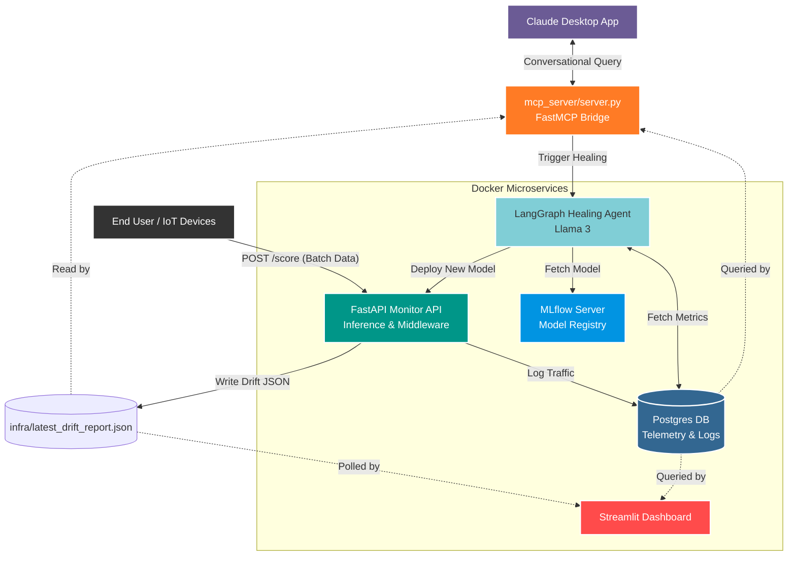

# 🌌 AetherHeal: Self-Healing ML Pipeline

[](https://www.python.org/downloads/)
[](https://opensource.org/licenses/MIT)
[]()

**AetherHeal** is an advanced, autonomous machine learning pipeline designed for high-availability environments. It integrates real-time monitoring with a Large Language Model (LLM) powered agent to automatically diagnose and remediate issues like data drift, model degradation, and system failures. 

This project represents the convergence of **MLOps** and **Agentic AI**. It transitions the pipeline from the industry-standard "Human-in-the-loop" resolution to a fully autonomous, zero-downtime architecture.

---

## 🏗️ Complete System Architecture & Data Flow

The system operates in a continuous loop of **Training ➡️ Serving ➡️ Monitoring ➡️ Healing**.



---

## 🧠 The Agentic Architecture

### 1. The Main State Graph (`LangGraph`)
AetherHeal uses a **State-Driven, Tool-Augmented LLM Graph** based on the **ReAct (Reasoning and Acting)** framework, implemented via `LangGraph`.

1. **The State (`AgentState`)**: The agent maintains a memory dictionary tracking its context (the drift report), reasoning, the tool it decided to call, the result, and iteration count.
2. **The `diagnose` Node**: The LLM (Groq Llama-3) analyzes the JSON drift report. It deduces the root cause (e.g., Concept Drift vs. Data Corruption) and decides which tool to use.
3. **The `execute` Node**: This node safely runs the requested Python function (e.g., `trigger_retraining()` or `rollback_model()`).
4. **Self-Correction (The Edges)**: If a tool fails or the issue persists, the graph loops back to the `diagnose` node. The LLM reads the failure output and tries a different remediation strategy, preventing hard crashes.

### 2. Agent Tools vs. MCP Tools
Understanding the difference between the tools in this project is critical:

- **Agent Tools (`agent/tools.py`)**: These are internal, autonomous functions that the LangGraph LLM uses to mutate the pipeline. They include actions like `trigger_retraining()` and `rollback_model()`. The Agent decides *when* to use them based on its reasoning.
- **MCP Tools (`mcp_server/server.py`)**: These are conversational interfaces built using the FastMCP standard. They allow an external LLM (like Claude Desktop) to view the pipeline state, read metrics, or manually kick off the LangGraph agent via a chat interface. They bridge the gap between human SREs and the autonomous system.

---

## ⚙️ Core Backend Layers & Performance Optimizations

### 1. Non-Blocking Drift Middleware
Calculating Jensen-Shannon divergence across multiple features for every incoming batch of data is highly CPU-intensive. If calculated synchronously, the `/score` endpoint would block, spiking inference latency.
**Optimization**: We implemented Starlette `BaseHTTPMiddleware` to yield the prediction response immediately, while offloading the heavy JS Math to a background OS threadpool. Sub-millisecond inference latency is maintained even under heavy load.

### 2. Agentic Reasoning over Simple Thresholds
A naive system would simply execute `if JS_Divergence > 0.1: retrain_model()`. However, if the divergence was caused by transient noise (e.g., massive Null injections), retraining the model on corrupted data would destroy its accuracy.
**Optimization**: When drift is detected, the LLM acts as an investigator. It reads the logs. If it sees Nulls, it skips retraining. If it sees legitimate concept drift, it triggers retraining. This ensures zero false-positive retrainings.

### 3. In-Memory Model Caching
To prevent slow disk I/O on every `/score` request, the FastAPI app uses an asynchronous `lifespan` context manager. On startup, it connects to MLflow, pulls the model tagged `LKG` (Last Known Good), and loads it into a global cache for instantaneous predictions.

---

## 🚀 Setup & Installation

### 1. Configure Environment
Create a `.env` file in the `self-healing-pipeline/` directory. Ensure that `MLFLOW_TRACKING_URI` is correctly set so your local agent can communicate with the MLflow container over HTTP:
```env
GROQ_API_KEY=your_groq_api_key
POSTGRES_DB=pipeline_db
POSTGRES_USER=pipeline_user
POSTGRES_PASSWORD=pipeline_pass
MLFLOW_TRACKING_URI=http://localhost:5000
```

### 2. Install Dependencies
```bash
python -m venv venv
source venv/Scripts/activate
pip install -r self-healing-pipeline/requirements.txt
```

### 3. Run the Entire Pipeline (One-Click Deploy)
With our fully containerized setup, you can launch the Postgres DB, MLflow Tracking Server, FastAPI Monitor, and Streamlit Dashboard simultaneously using Docker Compose:
```bash
cd self-healing-pipeline
docker-compose up --build -d
```

### 4. Access the Services
- **Streamlit Dashboard**: [http://localhost:8501](http://localhost:8501)
- **FastAPI Monitor**: [http://localhost:8000/docs](http://localhost:8000/docs)
- **MLflow Registry**: [http://localhost:5000](http://localhost:5000)

### 5. Generate Baseline Model (Inside Monitor Container)
To kickstart the pipeline with a highly-accurate baseline model, run the training script inside the running monitor container:
```bash
docker exec -it aether_monitor python model/train.py
```

---

## 🧪 Chaos Testing (Injecting Drift)

To see the self-healing in action, you must trigger a statistical anomaly.

1. **Inject real data drift**:
   ```bash
   python chaos/inject_drift.py
   ```
   *This artificially shifts the `Amount` feature by +600 and sends it to the monitor, calculating a real JS Divergence score.*

2. **Run the Agent to Heal the System**:
   ```bash
   python agent/graph.py
   ```
   *Watch the Streamlit UI to see the agent read the JS score, deduce "Concept Drift", and autonomously execute the `trigger_retraining` tool.*

---

## 🔌 Claude Desktop Integration (MCP Registry)

AetherHeal includes a built-in **Model Context Protocol (MCP)** server via the `mcp` library, allowing AI assistants like Claude Desktop to natively monitor and heal your pipeline.

1. Add the following to your Claude Desktop configuration file (typically located at `%APPDATA%\Claude\claude_desktop_config.json` on Windows, or `~/Library/Application Support/Claude/claude_desktop_config.json` on macOS):

   ```json
   {
     "mcpServers": {
       "aether_heal": {
         "command": "C:/Users/Devansh/aether-heal/venv/Scripts/python.exe",
         "args": [
           "C:/Users/Devansh/aether-heal/self-healing-pipeline/mcp_server/server.py"
         ]
       }
     }
   }
   ```
   *(Ensure you update the paths to match your absolute project directory).*

2. Restart Claude Desktop. You will see the **plug icon** indicating the AetherHeal MCP server is connected.
3. You can now prompt Claude directly:
   - *"What is the current drift status of the pipeline?"*
   - *"Inject an outliers chaos scenario into the data stream."*
   - *"Trigger the LangGraph healing agent."*

---

## 📄 License
This project is licensed under the MIT License - see the [LICENSE](LICENSE) file for details.
