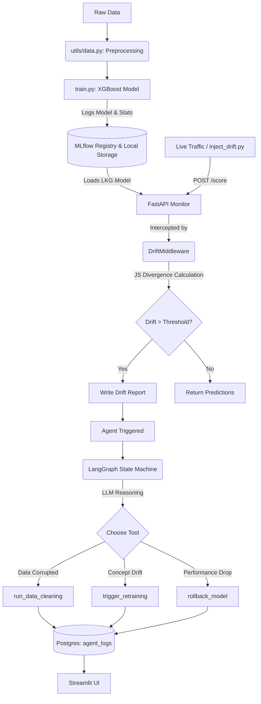

# 🌌 AetherHeal: Self-Healing ML Pipeline

[](https://www.python.org/downloads/)
[](https://opensource.org/licenses/MIT)
[]()

**AetherHeal** is an advanced, autonomous machine learning pipeline designed for high-availability environments. It integrates real-time monitoring with a Large Language Model (LLM) powered agent to automatically diagnose and remediate issues like data drift, model degradation, and system failures.

---

## 🏗️ Complete System Architecture & Data Flow

The system operates in a continuous loop of **Training ➡️ Serving ➡️ Monitoring ➡️ Healing**.



---

## 🧠 The Agentic Architecture

AetherHeal uses a **State-Driven, Tool-Augmented LLM Graph** based on the **ReAct (Reasoning and Acting)** framework, implemented via `LangGraph`.

1. **The State (`AgentState`)**: The agent maintains a memory dictionary tracking its context (the drift report), reasoning, the tool it decided to call, the result, and iteration count.
2. **The `diagnose` Node**: The LLM (Groq Llama-3.3) analyzes the JSON drift report. It deduces the root cause (e.g., Concept Drift vs. Data Corruption) and decides which tool to use.
3. **The `execute` Node**: This node safely runs the requested Python function (e.g., `trigger_retraining()` or `rollback_model()`).
4. **Self-Correction (The Edges)**: If a tool fails or the issue persists, the graph loops back to the `diagnose` node. The LLM reads the failure output and tries a different remediation strategy, preventing hard crashes.

---

## ⚙️ Core Backend Layers & Performance Optimizations

### 1. The FastAPI Monitor & Threadpool Middleware
The `/score` endpoint uses a custom `DriftMiddleware` to intercept incoming data.
- **The Problem**: Calculating Jensen-Shannon (JS) Divergence is a heavy CPU-bound task. Doing this directly in the middleware would block FastAPI's asynchronous event loop, freezing the server.
- **The Solution (Threadpool)**: The math is offloaded using Starlette's `run_in_threadpool`. This throws the CPU-heavy Pandas/Numpy operations into a background OS thread, freeing the main async loop to instantly accept thousands of new scoring requests concurrently.

### 2. In-Memory Model Caching
To prevent slow disk I/O on every `/score` request, the FastAPI app uses an asynchronous `lifespan` context manager. On startup, it connects to MLflow, pulls the model tagged `LKG` (Last Known Good), and loads it into a global `MODEL_CACHE` for sub-millisecond predictions.

### 3. DB Connection Pooling
Every decision the agent makes is tracked in PostgreSQL. To handle high-throughput logging without exhausting database connections, SQLAlchemy's `create_engine` utilizes `pool_size` and `max_overflow`.

### 4. Centralized Data Loading & Optuna Tuning
`utils/data.py` centralizes preprocessing so training, cleaning, and chaos injection always use the identical data schema. `model/train.py` utilizes **Optuna** to automatically find the best XGBoost hyperparameters during autonomous auto-retraining.

---

## 📂 Project Structure

```text
aether-heal/
├── self-healing-pipeline/
│   ├── agent/           # LangGraph Agent (Reasoning & Tools)
│   ├── chaos/           # Chaos Engineering (Failure Injection)
│   ├── model/           # ML Training & Registry Logic
│   ├── monitor/         # Prometheus & FastAPI Monitoring Service
│   ├── pipeline/        # Prefect Orchestration Logic
│   ├── ui/              # Streamlit Dashboard
│   ├── infra/           # Infrastructure logs & configurations
│   ├── utils/           # Centralized DB and Data logic
│   └── requirements.txt # Project dependencies
├── venv/                # Local virtual environment
├── .gitignore           # Git exclusion rules
└── README.md            # You are here
```

---

## 🚀 Setup & Installation

### 1. Configure Environment
Create a `.env` file in the `self-healing-pipeline/` directory:
```env
GROQ_API_KEY=your_groq_api_key
POSTGRES_DB=pipeline_db
POSTGRES_USER=pipeline_user
POSTGRES_PASSWORD=pipeline_pass
```

### 2. Install Dependencies
```bash
source venv/Scripts/activate
pip install -r self-healing-pipeline/requirements.txt
```

### 3. Run the Infrastructure (Terminal 1)
```bash
# Start Postgres & MLflow
docker-compose up -d

# Start the MLflow UI (if running locally without Docker)
mlflow ui --port 5000
```

### 4. Start the Monitor & UI
```bash
# Terminal 2: Monitor
uvicorn monitor.app:app --host 0.0.0.0 --port 8000

# Terminal 3: Dashboard
streamlit run ui/app.py
```

### 5. Generate Baseline Model
```bash
python model/train.py
```

---

## 🧪 Chaos Testing (Injecting Drift)

To see the self-healing in action, you must trigger a statistical anomaly.

1. **Inject real data drift**:
   ```bash
   python chaos/inject_drift.py
   ```
   *This artificially shifts features (like `MonthlyCharges`) and sends it to the monitor, calculating a real JS Divergence score.*

2. **Run the Agent to Heal the System**:
   ```bash
   python agent/graph.py
   ```
   *Watch the Streamlit UI to see the agent read the JS score, deduce "Concept Drift", and autonomously execute the `trigger_retraining` tool.*

---

## 📄 License
This project is licensed under the MIT License - see the [LICENSE](LICENSE) file for details.
